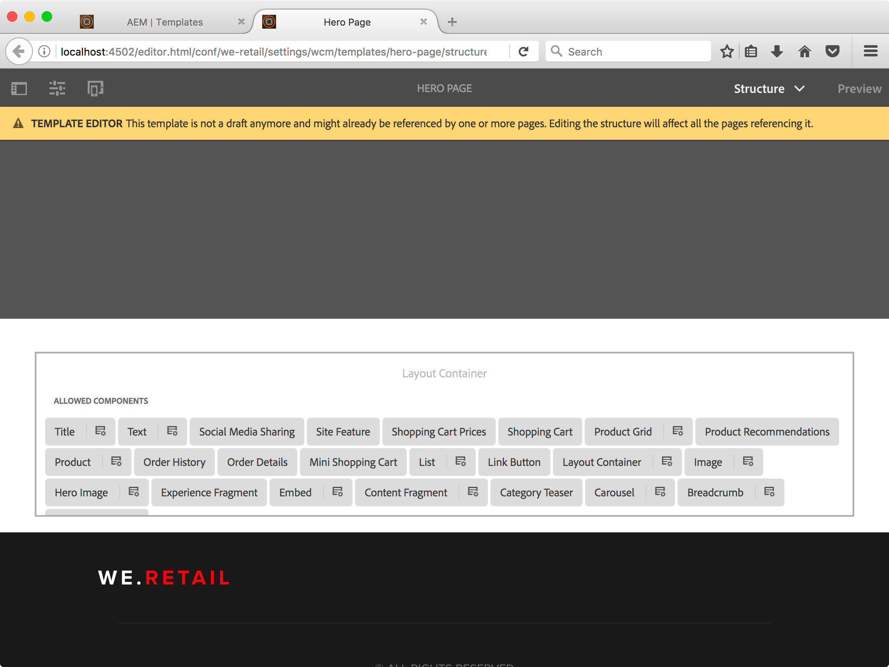
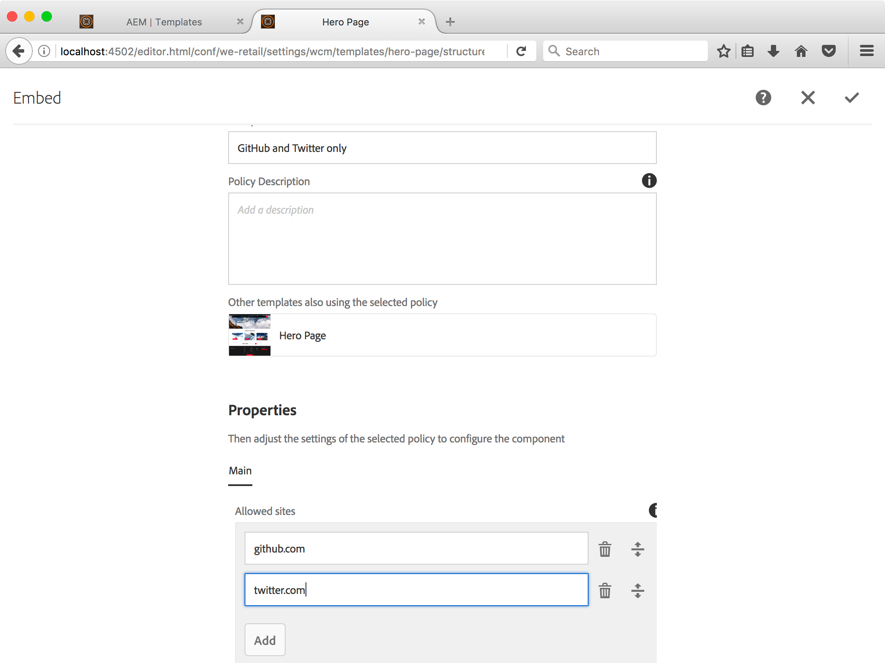
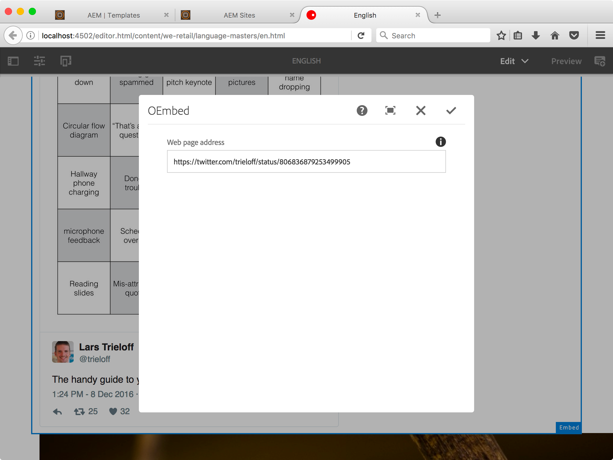
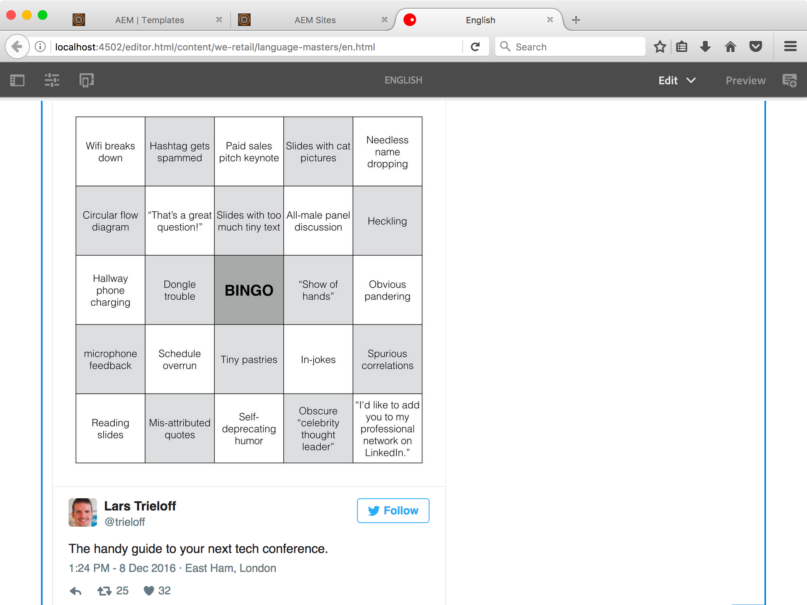
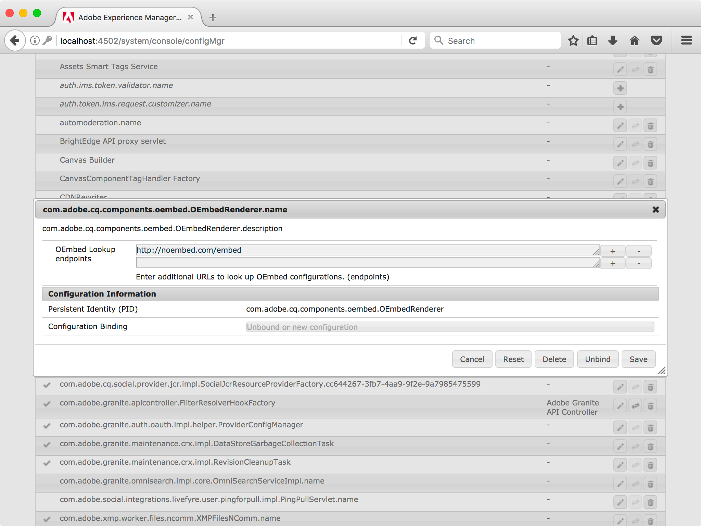
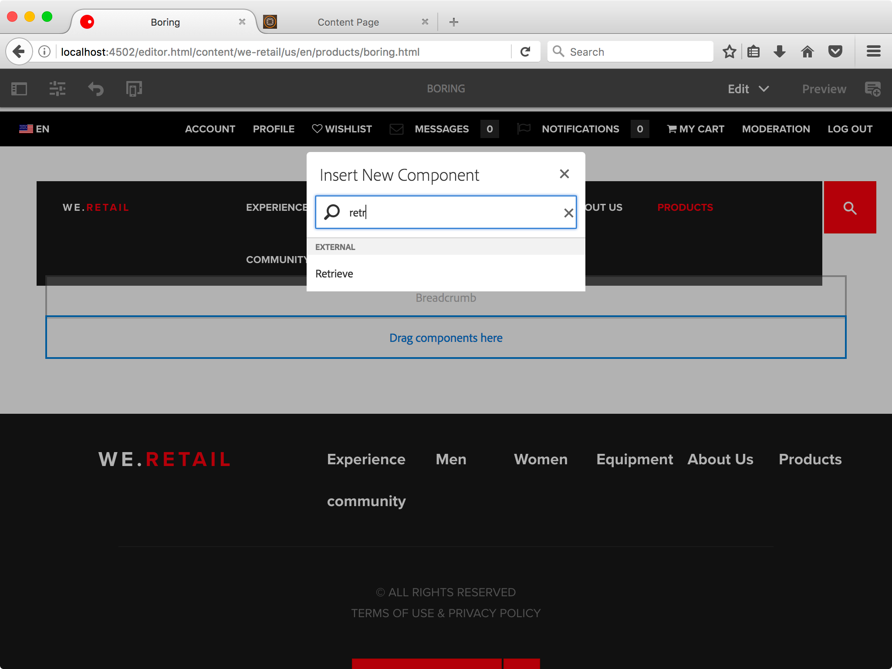
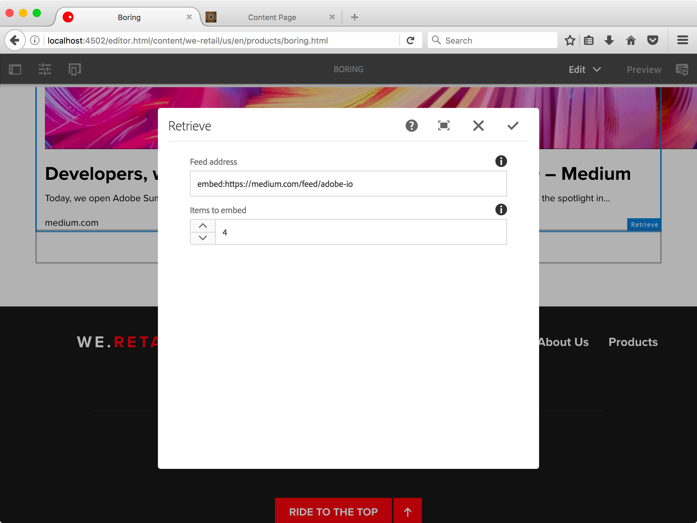
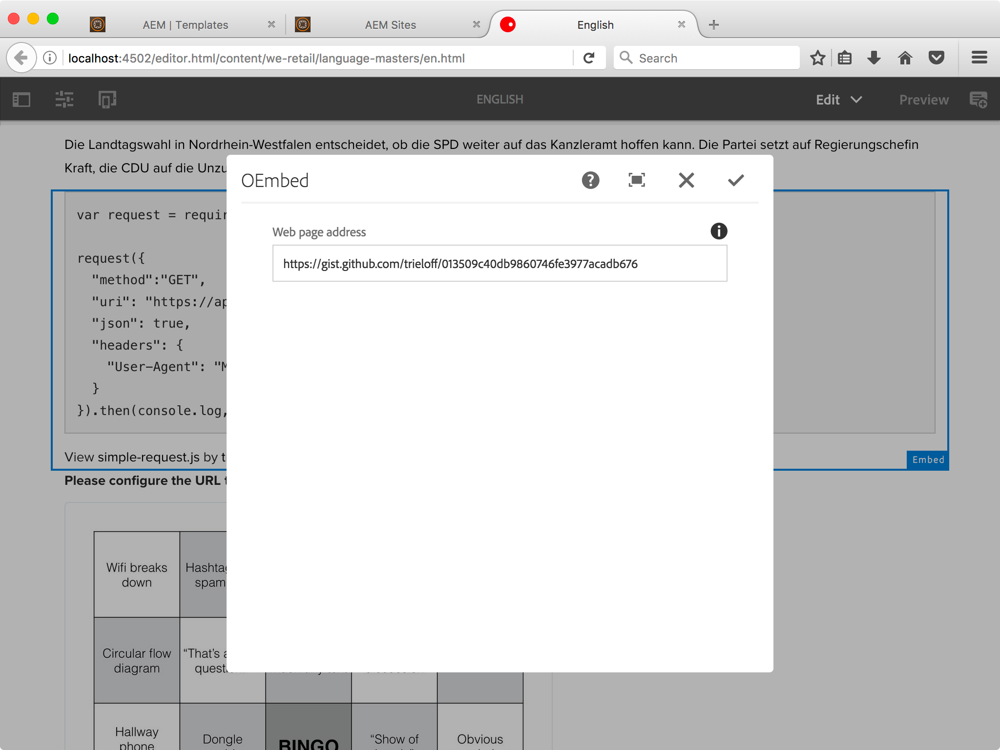
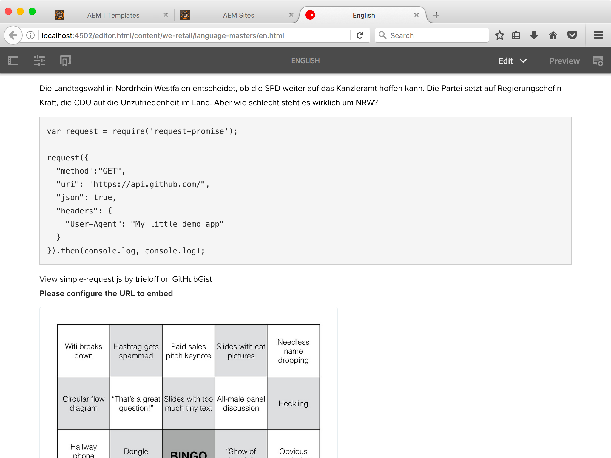
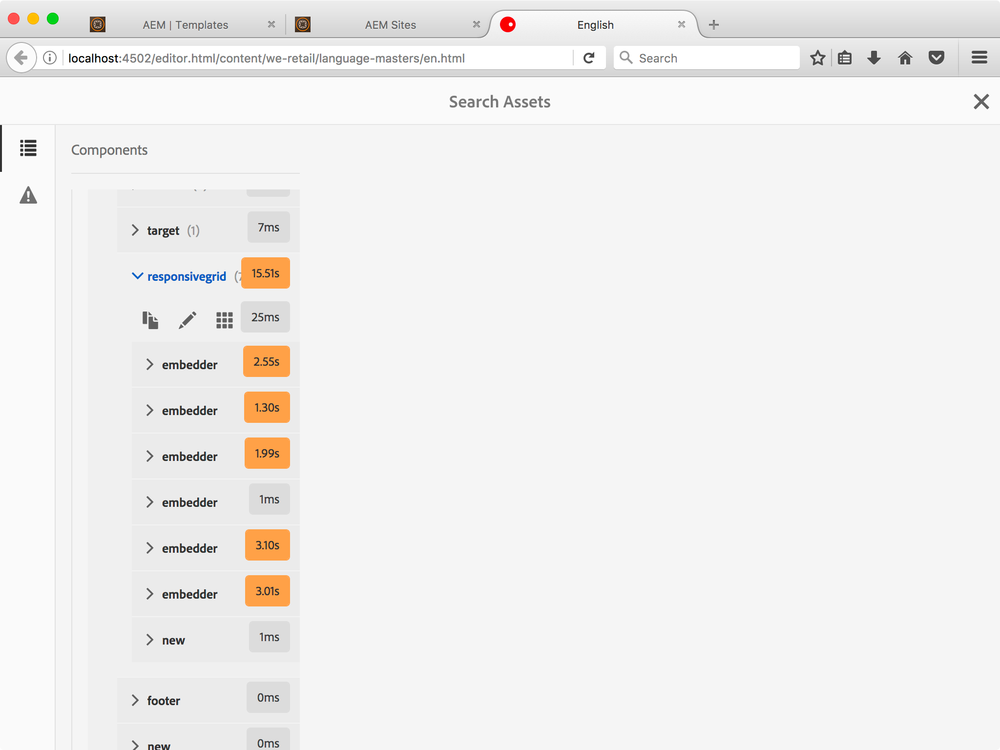

# AEM Ober-Embed Component

Do you love having AEM sites with rich content, but hate creating rich content? *Why write content when you can just stea^H embed it?*

Ober-Embed is a component for [Adobe Experience Manager](http://www.adobe.com/solutions/web-experience-management.html) that allows you to embed content from other websites simply by providing a URL. Ober-Embed tries to find the best way to embed the content, using:

* [oEmbed](http://oembed.com/) Autodiscovery (supported by YouTube, Twitter, and more)
* [oEmbed](http://oembed.com/) manual discovery using configured OEmbed providers (I recommend [Noembed](https://noembed.com) for Amazon, Gyfcat, XKCD)
* [Twitter Cards](https://dev.twitter.com/cards/markup) for many new websites
* [Facebook OpenGraph markup](https://developers.facebook.com/docs/sharing/webmasters) for most other websites
* [Plain old HTML title tags](https://developer.mozilla.org/en-US/docs/Web/HTML/Element/title) for literally any other website

The component can embed content, including title, description, images, videos or even interactive content (using OEmbed). Because the OEmbed providers are configurable, you can set your own providers (for instance using [Adobe I/O Runtime](https://www.adobe.io/apis/cloudplatform/runtime.html)) or switch providers if you need more sites supported. The OEmbed providers are configured in the OSGi console, so that authors only have to know the URL of the page they want to embed.

**In addition, this project comes with a component that allows automatic retrieval of embeddable content using RSS feeds.** You set up a feed address and AEM will automatically embed previews of the most recent blog posts and link them to the blog. 

## Installation

To install the component:

* Build and install the component into your AEM instance using [Apache Maven](http://maven.apache.org/):
```
mvn -P installPackage install
```

## Usage

### Before You Start Editing
You have to enable the component in design mode for the templates where you want to allow using embedded content. Open a template of your choice and drag the component into the *Layout Container*.



#### (Optional) White List Sites to Embed Content from

By default, the AEM Embed component allows embedding content from any site, but you can enable further restrictions through content policies. Tap on the *Configuration* button on the *Embed* label to open the Content Policy Configuration.



You can manage multiple content policies for different parts f your site. If you don't set any allowed sites, then content from anywhere can be embedded.

#### (Optional) Configure Maximum Number of Snippets to Retrieve

The AEM Retrieve component (which you can enable in the same way as the Embed component is enabled) supports only one configuration setting: the maximum number of snippets to embed.

The default value is three, but can be overridden by authors on the page.


##### Important: Set Permissions for `polling-importer`

In AEM 6.3, the `polling-importer` service account does not have the necessary default permissions to create content underneath the `/content` tree. This means, the Retriever component will not be able to retrieve content and save it in the repository.

To fix this, go to AEM Security settings and change the permissions of the `polling-importer` service account so that it has Create, Update and Delete permission in the locations where you want to enable automated embedding.

## Embedding Content

To embed content, open the page you want to edit in AEM's editor  and drag the Embed component into the appropriate layout container. Tap the component, and then the *settings wrench* to open the edit dialog. Enter (or copy & paste) the URL of the page you'd like to embed and tap the checkmark button to save.



Because Twitter supports OEmbed auto discovery, a rich representation of the tweet will be added to your page.



## Advanced Configuration

Not all sites that you would like to embed have support for OEmbed auto discovery, which means that the embedded content will not be interactive. 

Ober-Embed allows the configuration of additional OEmbed providers (these are websites that translate the URL of a page into an embeddable version). To do so, open the AEM OSGi console and find the *OEmbedRenderer* component.



The OEmbed component will try all endpoints in order until it has found one that provides an embeddable representation. This means, do not configure too many providers, as it may slow down your AEM instance.

## Automated Embedding

If you want to keep a small number of automatically updating snippets, for example a list of recent blog posts published on an external blog, you can use the *Retrieve* component.



Once the component has been added, configure it by clicking on the settings wrench and then enter the URL of an Atom or RSS feed. You can also set the number of items to embed. If you don't change this setting, the three most recent posts will be shown.



The importer is using the `embed:` URL scheme, so don't worry about having this in front of the URL.

### Example: Embedding GitHubGist

GitHubGist is a great site, but they have dropped support for OEmbed auto discovery a few years ago. If you are running an OEmbed provider that is using the GitHub API (see (github-oembed)[https://github.com/trieloff/github-oembed] for an example), you can embed Gists or files from GitHub.





## Performance Considerations

Embedding requires AEM to retrieve the content of each embedded page, which means your own site will be as slow as the slowest site you are embedding from.



This means for you: **do not forget to set up proper caching**. Having external, rich content is great. Having a slow site is not great.

## Thanks
* [Paolo](https://github.com/paolomoz/oembed)
* [Ugo](https://github.com/ugocei/oembed)

## FAQ
### Why is it called Ober-Embed?

Because it's based on OEmbed and Uber-Embed would be too cliche.